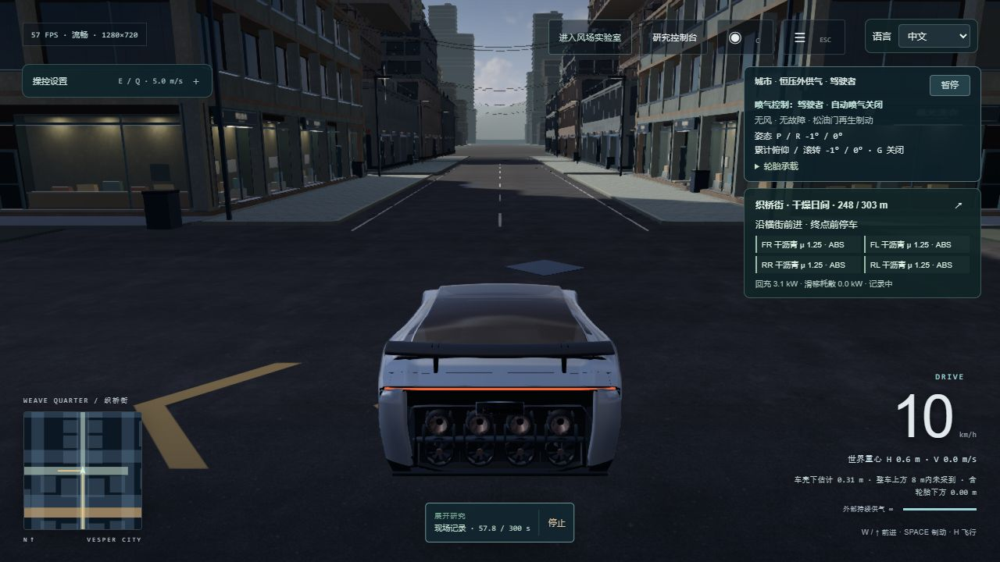
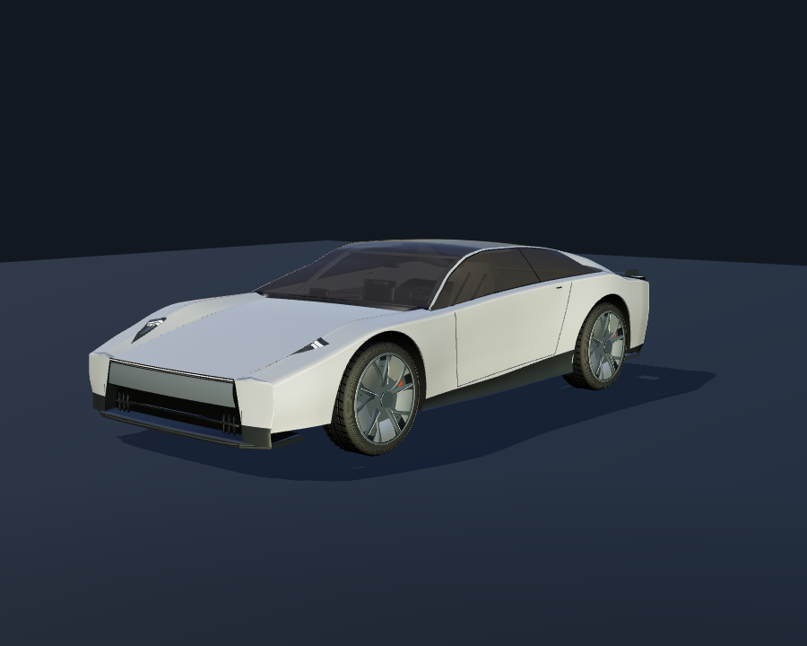
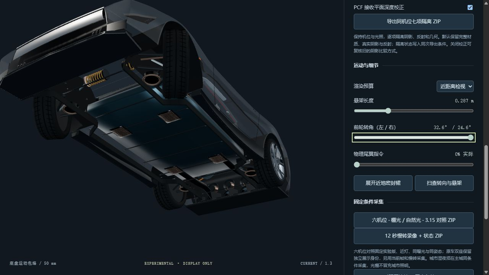

# Roadster Flight Lab

Drive a cold-gas-powered flight concept through Vesper. Follow the elevated roads into the city, brake for the turn on Weave Street and stop inside the marked circle. Take the same car into the lab to measure the cost of a wet road or compare two flight controllers in the same gust.

**[Enter the city](https://windscode.github.io/roadster-flight-lab/)** · [Braking experiments](https://windscode.github.io/roadster-flight-lab/?view=study) · [Wind laboratory](https://windscode.github.io/roadster-flight-lab/?view=lab) · [Vehicle workshop](https://windscode.github.io/roadster-flight-lab/vehicle-inspection.html) · [中文](README.md)

## First visit

| To try | Where to start |
| --- | --- |
| Drive and fly | Choose **Enter city**. W / S accelerate, slow and reverse. A / D steer. Space brakes. In open space, H enables flight assistance and E / Q command climb and descent. |
| Learn a braking line | Choose **Routes & challenges → Prepare route → Drive and record**. Cross the three amber lines, turn left and stop inside the teal ring for half a second. Free practice lets you stop and study the turn. |
| Compare stopping distances | Open **Braking experiments**, select the surface and initial battery charge, then pair regeneration off and on. Read distance, battery recovery and friction heat together. |
| Compare flight controllers | Open the **Wind laboratory**, select a disturbance, initial state and controller, and record a run. Review inputs and attitude, or compare controllers from the same initial state. |
| Inspect the car | The **Vehicle workshop** has exterior, chassis and cutaway views. Adjust steering and suspension travel to see the pushrods, dampers and active wing. |

C cycles cameras, M opens the map and P or Esc pauses. The application provides automatic maneuvers, key remapping and gamepad calibration. On-screen hints follow the active bindings. City driving, challenges and laboratory runs use the same 120 Hz dynamics and resource accounting. Start in a desktop browser.

## How much earlier should you brake in the wet?

Start at 80% charge with an 80 km/h target and repeat the same brake command. In this model the wet surface adds 17.26 m to the dry stop. Regeneration shifts part of the work from the friction brakes to the battery.

| Surface | Stopping distance (regen off / on) | Battery recovery (on) | Friction heat (off → on) |
| --- | ---: | ---: | ---: |
| Dry | 24.97 / 24.97 m | 6.73 Wh | 130.45 → 121.81 Wh |
| Wet | 42.23 / 42.23 m | 6.04 Wh | 124.70 → 116.96 Wh |
| Split grip | 30.76 / 30.76 m | 6.47 Wh | 128.66 → 120.37 Wh |

All six runs entered braking at 79.34–79.35 km/h. Energy is measured from brake onset to the first stop, confirmed by another half-second below 0.1 m/s. [Run the experiment](https://windscode.github.io/roadster-flight-lab/?view=study) · [Six measured runs](qa/release-1.3/driving-study.json)

## One street, three driving strategies

The finite-resource route starts with **120 Wh available and a 600 L tank at 100 bar**. Cover 302.5 m within 65 seconds and retain at least 5 Wh and 5 kg of gas. Regeneration follows measured wheel work. The motor, fan, auxiliaries and valves draw from their respective supplies.

| Dry daylight, identical full starting state | Time | Net battery use | Recovered | Onboard gas used |
| --- | ---: | ---: | ---: | ---: |
| Economy | 52.82 s | 56.74 Wh | 13.63 Wh | 0 kg |
| Balanced | 43.73 s | 70.04 Wh | 16.14 Wh | 0 kg |
| Boost-assisted launch | 40.93 s | 61.48 Wh | 16.14 Wh | 15.67 kg |

These are three complete 1.3 simulation runs using ordinary throttle, brake, steering and jet inputs. Net battery use already accounts for regeneration. Open the four sectors after a run to see where time, electricity and gas went. Matched finishes include per-sector differences. An interrupted attempt retains the timing lines already crossed. [Finite-route runs](qa/resource-1.3) · [A complete keyboard drive and its original-condition replay](qa/browser-1.3/observations.json)

## Vehicle, city and laboratory

- **Driving and flight.** Each wheel has its own contact, suspension and grip state. Manual valves, flight assistance, leveling and automatic maneuvers declare who controls thrust. Landing estimates account for pressure, energy, valve response and force direction.
- **Vehicle workshop.** Parametric surfaces and mechanical assemblies form the body, cabin, arches and underside. Paint, glass, rubber and metal use distinct materials. Public exterior views inform the independent reconstruction. Hidden linkages and the cold-gas installation are illustrative engineering assumptions. [Model references](dist/assets/references/README.md)
- **Explorable city.** Streets, ramps and elevated roads connect. Weave has double-level walkways, South Bank has tidal survey displays, the foundry district has machine-tool shopfronts, and the interchange displays viaduct pier and deck sections. Daylight, wet night and three quality levels are available. Buildings emphasize exterior streetscapes.
- **Repeatable research.** Records retain the complete physical initial state, effective inputs and build identity. Same-build replay checks state agreement. Compatible earlier records can be explicitly recomputed with the current model. Experiments, controller comparisons and results can be exported. This is an independent project for driving and control research.

See the vehicle and chassis in the workshop

[1.3 audit and scope](docs/release-1.3.md) · [Release checks](qa/release-1.3/validation.json) · [Browser acceptance](qa/browser-1.3/observations.json) · [Official Roadster exterior reference](https://www.tesla.com/roadster)

## Run locally

Use Node.js 22 or newer. Production dependencies and assets are vendored.

~~~sh
git clone https://github.com/Windscode/roadster-flight-lab.git
cd roadster-flight-lab
npm start
~~~

Open `http://127.0.0.1:8080/`. The editable runtime source lives in `dist/`. For the full release checks use the pinned DOM test dependency.

~~~sh
npm ci --prefix tests/dom --ignore-scripts
export JSDOM_MODULE_PATH="$PWD/tests/dom/node_modules/jsdom/lib/api.js"
npm run model:build
npm run test:release
node scripts/check-static.mjs
~~~

On PowerShell use `$env:JSDOM_MODULE_PATH = (Resolve-Path tests/dom/node_modules/jsdom/lib/api.js).Path`. The development guide describes historical check inputs and the current publication workflow. [Development guide](docs/DEVELOPMENT.md)

## Releases and feedback

1.0 was the first product release. Earlier 3.x numbers refer to development iterations. Versioned notes retain original measurements and scope. [1.2](docs/release-1.2.md) · [1.1](docs/release-1.1.md) · [1.0](docs/release-1.0.md) · [3.24](docs/release-3.24.md) · [Development direction](docs/development-plan.md) · [Live build identity](https://windscode.github.io/roadster-flight-lab/deployment.json)

Bug reports are welcome. Include the browser, quality preset, input sequence and an exported record when available. [Report an issue](https://github.com/Windscode/roadster-flight-lab/issues)

Original code and procedural assets use the MIT license. Third-party libraries and assets retain their respective licenses. [LICENSE](LICENSE) · [Asset credits](dist/CREDITS.md)
